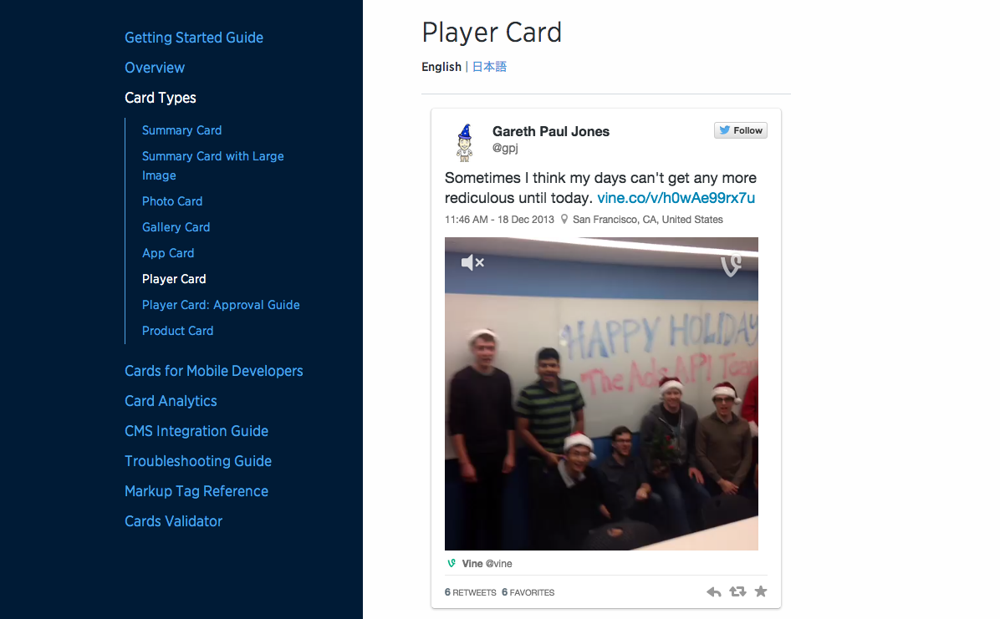

Twitter Cards Getting Started Bundle
=====

Thank you for downloading the Twitter Cards getting started bundle!

Player Card
-----

In the /player path, you'll find sample code to set up a simple Player Card for your site.

The basic steps to deploy are:

- Unzip the contents into a publicly accessible path on your website
- Open the page.html file and ensure the twitter:image, twitter:player and twitter:player:stream values point to your server and file locations
- Update the content that you're pointing to (don't use the sample video, please!)
- Ensure all paths are specified as secure (https://)
- Test your URL

To test your experience, please visit the following URL:

https://developer.twitter.com/en/docs/tweets/optimize-with-cards/overview/player-card

At that site, you will also find information on general rules, in case you choose to extend the experience to fit your own platform and media player.

Screenshot
-----

Additional Help
-----

If you need more help getting your Player Card working, please check out these additional resources:

- Player Card Documentation: https://developer.twitter.com/en/docs/tweets/optimize-with-cards/overview/player-card
- Cards Validator: https://cards-dev.twitter.com/validator
- Troubleshooting Guide: https://developer.twitter.com/en/docs/tweets/optimize-with-cards/guides/troubleshooting-cards
- Cards Forum: https://twittercommunity.com/c/publisher/cards
